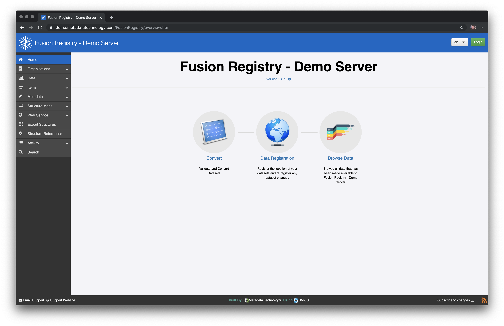
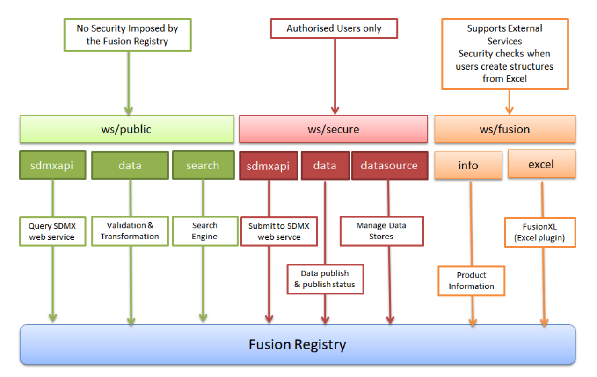

# Fusion Registry

From the official website:

> Fusion Registry 9 Enterprise Edition is an integrated management system for aggregated statistical data and metadata.
> 
> It uses SDMX, the international standard for describing and exchanging official statistics.
> 
> SDMX provides a flexible and proven multi-dimensional information model designed specifically for statistics, meaning Fusion Registry 9 can be used for any statistical domain.

## Documentation

* [FUSION REGISTRY COMMUNITY EDITION VERSION 9](https://metadatatechnology.com/assets/Custom/documentation/200_Fusion%20Registry%20Community%20Edition/101_Fusion%20Registry%20Community%20Edition%20Release%209.4/FusionRegistry9_UserGuide.pdf)
* [FUSION REGISTRY WEB SERVICES API](https://metadatatechnology.com/assets/Custom/documentation/100_Fusion%20Registry%209%20Enterprise%20Edition/1_Fusion%20Registry%20Enterprise%20Edition%20Release%209.4/FusionRegistry%209.4%20Web%20Services%20Reference.pdf)

## Demo instance

https://demo.metadatatechnology.com/FusionRegistry/



## Structures

There are five different structures:

1. Organisations
2. Item Schemes
3. Data Related Structures
4. Metadata Structure Definition
5. Structure Maps

All of them are available via web services.

### 1. Organizations

* **Data Provider**
	* Registers the URL where data can be obtained and is capable of loading its content.
* **Agency**
	* Owns other structures.
	* Has the responsibility of setting up a **Data Provider** to provide data for **Dataflows**.
* **Data Consumer**
	* Users of the web services.

### 2. Item Schemes

* **Codelist**
	* Define allowable content for both data and metadata. Used by **Dimensions**, **Concepts**, and **Metadata Attributes**.
* **Concept Scheme**
	* Provides "semantic meaning" for **Dimensions**, **Concepts**, and **Metadata Attributes**.
* **Category Scheme**
	* Provides means to categorize other structure types.
* **Hierarchical Codelist**
	* Hierarchical view over one or more **Codelists**.


### 3. Data Related Structures

* **Data Structure Definition**
	* Defines a dataset.
* **Dataflow**
	* Structure for collecting and disseminating data. It has a **Data Structure Definition** related.
* **Provision Agreement**
	* Union of **Dataflow** with **Data Provider**.
* **Reporting Constraint**
	* Restricts access to **Reporting Constraints**.
* **Pre-Defined Queries**
	* It works like a database view for **Dataflows**.

### 4. Metadata Structure Definition

Just like **Data Structure Definition**, but for **Metadata Reports**

### 5. Structure Maps

* **Concept Scheme Map**
	* Relates two **Concept Schemes**.
* **Codelist Map**
	* Relates two **Codelists**.
* **Data Structure Map**
	* Relates two **Data Structure Definitions**.
* **Dataflow**
	* Relates two **Data Structure Definitions**.

## Webservice

https://demo.metadatatechnology.com/FusionRegistry/webservice/data.html

**Architecture**



## Libraries

There is an official Javascript library that helps to integrate with the webservice. It is called IM-JS (Information Model JS) and has documentation available in https://metadatatechnology.com/standalone/IMJS/index.html. 

### IM-JS

The library itself can be found in this link: https://registry.sdmxcloud.org/assets/js/imjs/imjs.min.js. A non-minified vesion of this file is available in [imjs.js](./imjs.js) for helping to understand the behavior of each function.

It is possible to observe multiple errors in the documentation of this library, such as appending to a non-existent HTML node, and creating a table without `<tr>`'s. Also, not every endpoint and function is documented.

A working example of how to communicate with a Fusion Registry Webservice through IM-JS is available in [fusion-registry.html](./fusion-registry.html).

This library uses a format called "SDMX-JSON," which is described as in beta in the demo server.

`store_state` attribute is important, as it will automatically add attributes to future queries.

## Example projects

We received four different projects containing examples of how to connect to a Fusion Registry instance.

They are:

### IMJSTypeScript

A TypeScript project that transpiles to the `imjs.min.js` file. This project is written by Metadata Technology, the original authors of the library and Fusion Registry.

The zip fulfils the original request: to get access to the `imjs.min.js` file not publicly available; but that opens a couple of questions that could serve to speed up our work.

1. There's an HTML file importing the library. At first sight, it doesn't contain a working example of how to use the library. Is that correct? Or I should be able to find it? If so, I'd like to know what files I should pay attention to find this working example.
2. Is the library accompanied by documentation other than https://metadatatechnology.com/standalone/IMJS/index.html? We could already notice this link's examples something contain invalid JS. Given that the TypeScript project is a Git repository with commits from only two weeks ago, I suppose Metadata Technology is still working on the library. If that's true, they may have docs yet to be published to this public website.

* Git repository with last commit from Sep 27, 10 days before sending to us.
* Dozens of files changed without commit.

### DataBrowser

Source code for the data browser available in other instances such as the [demo one](https://demo.metadatatechnology.com/FusionRegistry/databrowser/index.html).

It contains a documentation of how to deploy it – it must be in the same domain as the webservice for not generating CORS errors – and how to use it as an end-user.

The project is served from a `.war` file, a set of `.jar` files. It can be extracted using the following command:

```shell
$ jar xvf FusionRegistry.war
```

The folder will contain plaintext HTML, CSS, and Javascript files.

Conclusion: it may be helpful as a resource for reference.

### SDMXUI

It contains a few `.html` files with common components such as `pivottable.html`. Most of them don't work out of the box, with some poiting to a server running on localhost. In some of these examples, changing the webserver url to the demo server don't make them work. Other cases, such as `stackedbar.html`, it works out of the box without errors.

### codepicker

Folder with only the `*.html` files from `SDMXUI/html`. It contains all the files present in SDMXUI and their md5 match.


---

# Domain Model

* Datasets (aka DataFlows)
  * Dimensions
  * Data (?) - series inside providers
* Categories and Providers
  * categories are predefined categoris in FR 
  * providers are the agencies that register and publish data

# Data Sample

https://demo.metadatatechnology.com/FusionRegistry/ws/public/sdmxapi/rest/data/ONS,GDP,1.0/all?format=sdmx-json&prettyPrint=true

TODO: map this to domain model


```json
{
  "header": {
    "id": "9c671f0ad7a40e5b4012ac41a30c2f3",
    "prepared": "2019-10-13T07:45:47",
    "test": false,
    "sender": {
      "id": "FR_DEMO"
    },
    "receiver": {
      "id": "ANONYMOUS"
    }
  },
  "dataSets": [
    {
      "action": "Information",
      "series": {
        "0": {
          "attributes": [],
          "observations": {
            "0": [
              "2"
            ]
          }
        },
        "1": {
          "attributes": [],
          "observations": {
            "0": [
              "2.3"
            ]
          }
        },
        "2": {
          "attributes": [],
          "observations": {
            "0": [
              "2.1"
            ]
          }
        },
        "3": {
          "attributes": [],
          "observations": {
            "0": [
              "2.1"
            ]
          }
        },
        "4": {
          "attributes": [],
          "observations": {
            "0": [
              "2.1"
            ]
          }
        },
        "5": {
          "attributes": [],
          "observations": {
            "0": [
              "1.9"
            ]
          }
        },
        "6": {
          "attributes": [],
          "observations": {
            "0": [
              "2.1"
            ]
          }
        }
      }
    }
  ],
  "structure": {
    "name": "Gross Domestic Product",
    "description": "The purpose of this dataflow in the Demo Matrix is to show how Observation Revisions are supported.",
    "dimensions": {
      "dataset": [],
      "series": [
        {
          "id": "MEASURE",
          "name": "Measure",
          "keyPosition": 0,
          "role": null,
          "values": [
            {
              "position": 5,
              "id": "BB1Est",
              "name": "BB1 Estimate"
            },
            {
              "position": 6,
              "id": "BB2Est",
              "name": "BB2 Estimate"
            },
            {
              "position": 7,
              "id": "L1",
              "name": "Latest Estimate"
            },
            {
              "position": 1,
              "id": "M1Est",
              "name": "Month 1 Estimate"
            },
            {
              "position": 2,
              "id": "M2Est",
              "name": "Month 2 Estimate"
            },
            {
              "position": 3,
              "id": "M3Est",
              "name": "Month 3 Estimate"
            },
            {
              "position": 4,
              "id": "V3Yr",
              "name": "Value 3 Years Later"
            }
          ]
        }
      ],
      "observation": [
        {
          "id": "TIME_PERIOD",
          "name": "Time",
          "keyPosition": 1,
          "role": "time",
          "values": [
            {
              "start": "1993-01-01T00:00:00",
              "end": "1993-12-31T23:59:59",
              "id": "1993",
              "name": "1993"
            }
          ]
        }
      ]
    },
    "attributes": {
      "dataset": [],
      "series": [],
      "observation": []
    }
  }
}
```
